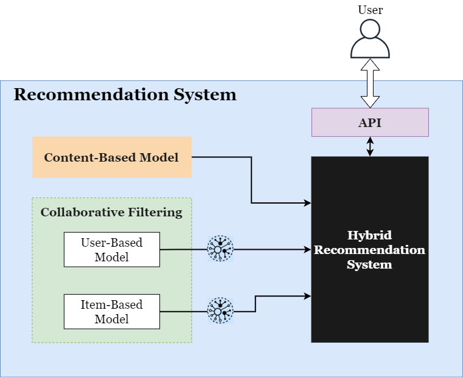

# ICARUS Recommender
## Overview
The ICARUS Recommender a containerized service that aims to provide accurate and meaningful suggestions of data assets that exist in the ICARUS Repository to enable the stakeholders to find data assets relevant to their interests. It's using a hybrid approach, which combines content-based and collaborative filtering approaches to enrinch the precision of the recommendation and also address major issues like cold-start.

## Install
The whole service runs in the container, and the user needs only to run the docker commands.

### Docker build
```
docker build -t recommender_api .
```

### Docker run
```
docker run -d -p 5000:5000 --rm --name recommender_api recommender_api
```

### Docker stop
```
docker stop recommender_api
```


## Usage

### Recommender API
```
localhost:5000/api/v1/recommender/
```

### POST Request: Required Body
```
{
	"org_id": "1",
	"datasets_id": [
		"dataset1",
		"dataset2"
	]
}
```
* In this example, "1" is the organization ID and "dataset1", "dataset2" are data asset IDs. ("datasets_id" can be an empty list)

### POST Request: Response
```
{
	"recommended_datasets": [
		{
			"dataset_id": "123",
			"dataset_name": "dataset name",
			"org_id": "123",
			"org_name": "owner organization name",
			"coverphoto": "11"
		},
		{
			...
		},
		{
			"dataset_id": "456",
			"dataset_name": "dataset name",
			"org_id": "456",
			"org_name": "owner organization name",
			"coverphoto": "22"
		}
	]
}
```
* The objects in the "recommended_datasets" list are the top 10 (or less) recommended data assets in descending order (in the above example, "dataset_id":"123" is more relevant than "dataset_id": "456")

## Architecture
As already mentioned, recommender is a hybrid recommendation system, it uses content-based model and collaborative filtering, which it is consisted by a user-based model and an item-based model. It also provides an api to be able to retrieve the recommendations that it created.

